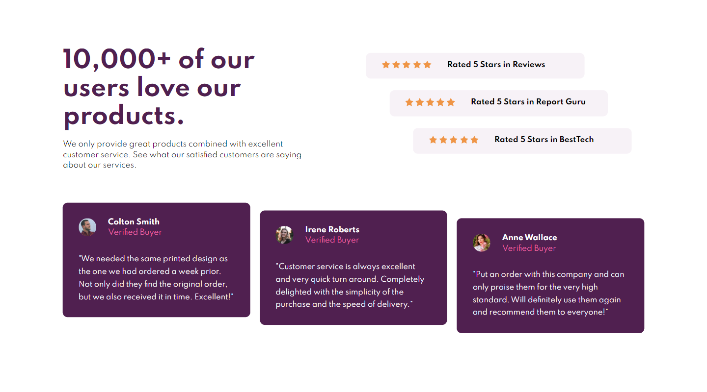
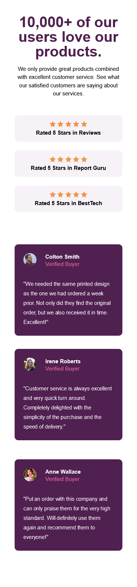

# Frontend Mentor - Stats preview card component solution

This is a solution to the [Stats preview card component challenge on Frontend Mentor](https://www.frontendmentor.io/challenges/stats-preview-card-component-8JqbgoU62). Frontend Mentor challenges help you improve your coding skills by building realistic projects.

## Table of contents

- [Overview](#overview)
  - [The challenge](#the-challenge)
  - [Screenshot](#screenshot)
  - [Links](#links)
- [My process](#my-process)
  - [Built with](#built-with)
- [Author](#author)

## Overview

### The challenge

Challenge was to develop given layout in give viewport:

- Mobile-view (375px)
- Desktop-view (1440px)

### Screenshot

### Links

- Solution URL: [Solution codes](https://github.com/DevanshChakravarti/Fontend-mentor-stats-preview-card)
- Live Site URL: [Live preview](https://devanshchakravarti.github.io/Fontend-mentor-stats-preview-card/)

### Built with

- Semantic HTML5 markup
- CSS custom properties
- Flexbox
- CSS Grid
- Mobile-first workflow

## Author

- Website - [Devansh Chakravarti](https://github.com/DevanshChakravarti)
- Frontend Mentor - [@Devansh](https://www.frontendmentor.io/profile/DevanshChakravarti)
